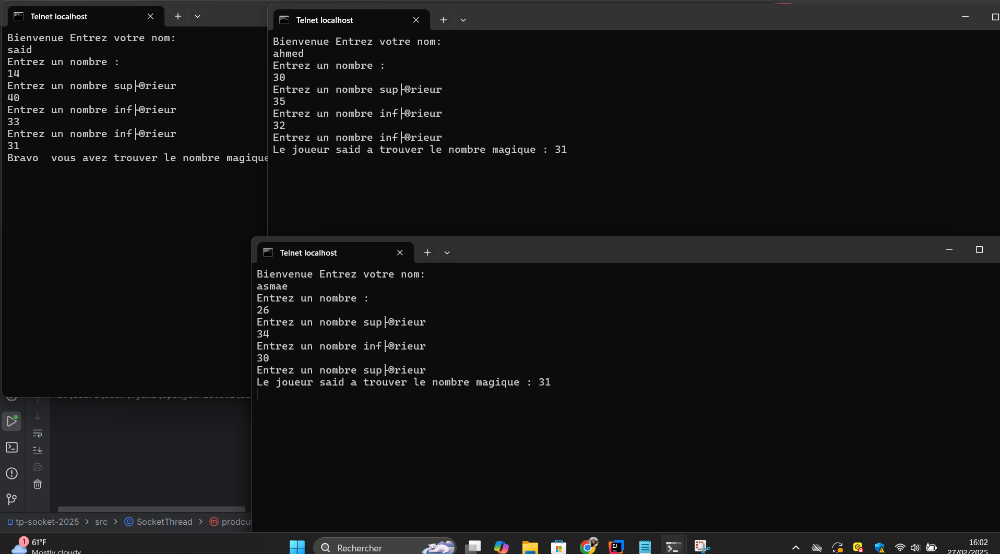

# 🎮 Jeu de Nombre Magique 🎩✨

Ce projet est une application Java basée sur **les sockets et les threads** qui permet à plusieurs clients de deviner un "nombre magique" généré par le serveur.

## 🚀 Fonctionnalités

- 🌍 **Communication en réseau** via **Sockets TCP**
- 🔁 **Multijoueur** avec gestion des connexions simultanées grâce aux **Threads**
- 🎲 **Nombre magique aléatoire** généré par le serveur
- 📢 **Messages interactifs** entre le serveur et les clients
- 🏆 **Affichage du gagnant** dès que quelqu'un trouve le bon nombre

## 📷 Capture d'écran


## 📦 Installation et Exécution

### 🔹 1. Cloner le projet
```bash
git clone https://github.com/nourthabet2002/app-chat-java.git
cd app-chat-java
